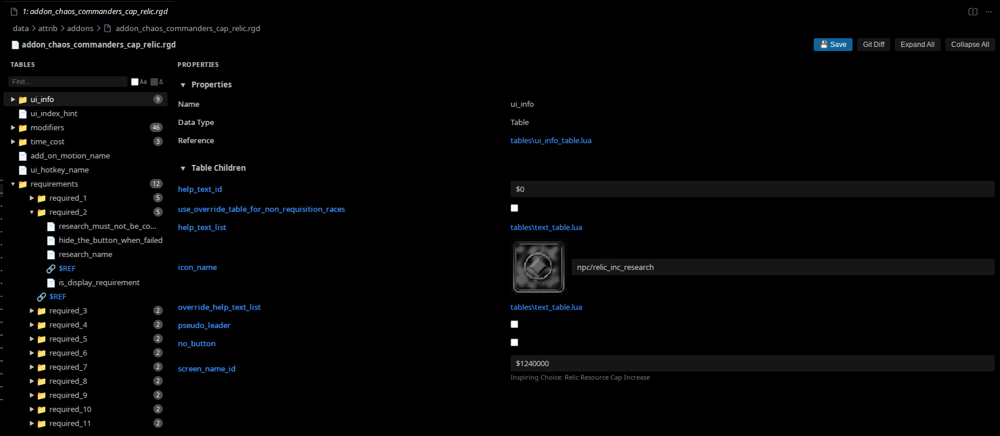
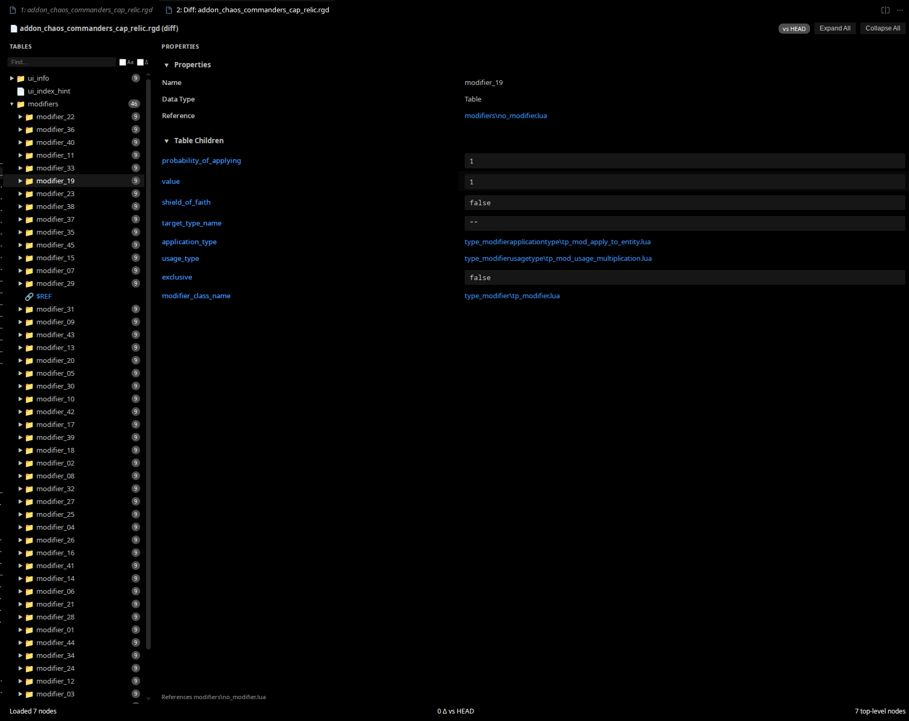
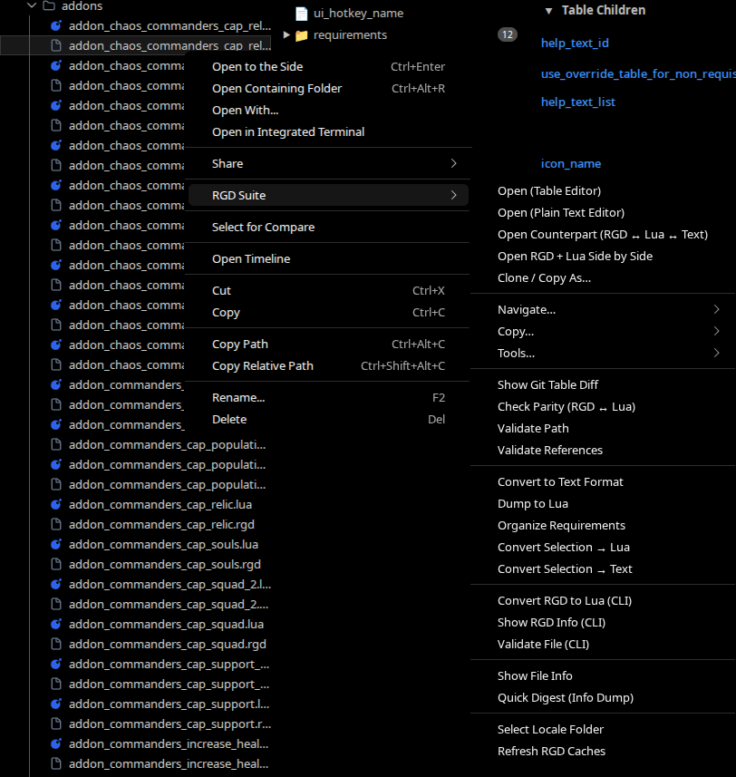
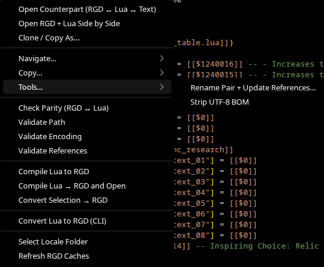

# RGD Suite

> **Corsix, but for VS Code!**

Complete VS Code / Windsurf extension for Relic Game Data (`.rgd`) files — the binary
attribute format used in Dawn of War and Company of Heroes modding.

Merges a table editor, RGD ↔ Lua ↔ text converter, validator, parity checker, and a
standalone CLI into one package, with an embedded hash dictionary.

[](https://github.com/CannibalToast/rgd-suite/releases/latest)

## Install

Download the `.vsix` from the [Releases](https://github.com/CannibalToast/rgd-suite/releases/latest) page and either:

- Drag and drop it into the Extensions panel, or
- Run: `code --install-extension rgd-suite-<version>.vsix`

## What it can do

- Open `.rgd` binaries as an editable tree + property grid, save back to binary automatically
- Preview icon/texture values inline (decodes TGA and DDS in the webview)
- Resolve `$ID` locale strings to real UCS text (11 languages selectable)
- Convert binary ↔ text ↔ Lua, single file or whole folders on worker threads
- Extract `.rgd` files out of SGA archives
- Diff RGD's against their Lua source (parity) or against git (key-level table diff)
- Validate encoding, paths, and `Reference()`/`Inherit` links
- Clone, rename, and rewrite references
- Run the whole thing headless from a standalone CLI

## Table Editor



- Familiar split-pane editor: table tree on the left, properties on the right
- Inline editing of values (floats, ints, bools and strings) writes back to binary format on save
- Clickable `$REF` values open the referenced .lua file. Inline hyperlinks to parent files across the workspace
- Icon/Texture previews!
  `tga` and `dds` directly in the webview, searched under the mod's `art/` and
  `attrib/` roots (`rgdEditor.showImagePreviews` to toggle)
- `$`-prefixed locale IDs resolved to UCS text on open
  (`rgdEditor.resolveLocaleStrings`, `rgdEditor.preferredLanguage`)
- Toolbar **Git Diff** mode: diff the open file vs `HEAD` with highlighted
  added/removed/changed rows and a clickable change list

## Peek at a binary without converting

Opening an `.rgd` in a text editor serves a parsed text view over a `rgd://`
virtual filesystem — handy for a quick look, search, or copy without creating
a `.rgd.txt` file. The `.rgd.txt` format also gets syntax highlighting and
clickable document links for file paths, `$ID` locale strings, and icon names.

## Sidebar Tree View

- Persistent RGD tree in the Explorer sidebar, auto-loads the active editor
- Inline value editing via input box
- Shares the parse cache with the table editor and `rgd://` view

## Conversion

| Command | Description |
| --- | --- |
| `RGD: Convert to Text Format` | Binary → `.rgd.txt` human-readable format |
| `RGD: Convert Text to Binary` | `.rgd.txt` → binary `.rgd` |
| `RGD: Dump to Lua` | Binary → differential Lua format |
| `RGD: Compile Lua to RGD` | Lua → binary `.rgd` |
| `RGD: Batch Convert Folder to Lua` | Batch Lua dump, worker-threaded |
| `RGD: Batch Compile Folder to RGD` | Batch compile, worker-threaded |
| `RGD: Extract from SGA Archive` | Extract `.rgd` files from SGA archives |
| `RGD: Show File Info` | Display file metadata |

Batch operations run on a worker pool (`rgdSuite.batchWorkers`, defaults to
`min(cpus − 1, 4)`). `.rgd.txt` auto-saves back to binary on save
(`rgdEditor.autoConvertOnSave`).

## Validation

Single file or whole-folder checks (`rgd.batchValidate`), also worker-threaded:

- **Encoding** — detects/strips UTF-8 BOM (`stripBom` command too)
- **Paths** — illegal characters, length, malformed references
- **References** — `Reference()`/`Inherit` links that point at missing files
  (`.nil` convention-aware, so intentional nil refs don't drown the report)
- **Folder structure** — misplaced files under `attrib`

## Parity Checker

Diff a binary `.rgd` against its Lua source to catch stale builds or manual
edits — single file or entire folder.

| Command | Description |
| --- | --- |
| `RGD: Check Parity (RGD ↔ Lua)` | Compare one `.rgd` / `.lua` pair |
| `RGD: Batch Parity Check (Folder)` | Recursively check all pairs, worker-threaded |

Results appear in **Output → RGD Parity Checker** with per-key
`[PASS]` / `[FAIL]` / `[SKIP]` lines.

## Git Table Diff



Compare a working-tree `.rgd` against a git revision at the key/value table
level — not a binary hex dump or lua table dump:

| Command | Description |
| --- | --- |
| `RGD Suite: Show Git Table Diff` | Open the table editor in git-compare mode |
| Table editor toolbar **Git Diff** | Diff vs `HEAD`: highlighted rows + change list |
| CLI `table-diff file.rgd [--ref HEAD]` | Machine-readable diff (`--format json`) |

Rows are colored added / removed / changed; click a list entry to jump to various keys

## Requirements organizer

`Organize Requirements` (editor toolbar) removes extra `required_none` slots and
renumbers the remaining requirement keys. Same operation is in
the CLI as `compact-requirements`. Also has a `--dry-run` flag.

## Explorer context menu

The **RGD Suite** right-click submenu covers everyday modding workflows
(inspired by Corsix Mod Studio):

| | |
| --- | --- |
|  |  |

| Area | Commands |
| --- | --- |
| Open | Table / text editor, open counterpart, RGD+Lua side-by-side, clone/copy as… |
| Navigate… | Open parent `Reference()`, find reverse references, search keys, find by name, reveal attrib root |
| Copy… | Attrib path, `data/attrib/…`, `Reference()` snippet, hash, file info JSON, names |
| Tools… | Rename pair **+ rewrite references** (optional recompile), compare tables, strip BOM, new RGD, digest, PowerShell CLI |
| Convert | Selection → Lua/RGD/text, dump & open, compile & open |
| Folder | Batch convert, batch validate/parity, key search, find files, new RGD |

## Standalone CLI

`cli/rgd-cli.js` runs without VS Code — same engine, flat subcommands,
`--format json` for scripting:

| Command | Description |
| --- | --- |
| `rgd to-text` / `from-text` | RGD ↔ `.rgd.txt` |
| `rgd to-lua` / `from-lua` | RGD ↔ differential Lua |
| `rgd batch-to-lua` / `batch-to-rgd` | Whole-folder conversion, `--workers N` |
| `rgd extract-sga` | Extract `.rgd` files from an SGA archive |
| `rgd info` | File metadata |
| `rgd hash` | Compute the RGD hash of a string |
| `rgd parity` / `parity-batch` | RGD vs Lua parity, `--format json` |
| `rgd validate` | Encoding/path/reference checks, `--format json` |
| `rgd table-diff` | Key-level diff vs a git ref, `--format json` |
| `rgd compact-requirements` | Drop `required_none` slots, `--dry-run` |

Common flags: `-a/--attrib` (attrib root for parent/reference resolution),
`-d/--dictionary` (extra hash dictionary), `--version 1|3` (RGD format version).

## Configuration

| Setting | Default | Description |
| --- | --- | --- |
| `rgdEditor.dictionaryPaths` | `[]` | Additional hash dictionary files |
| `rgdEditor.preferredLanguage` | `Chinese` | Language for UCS string resolution |
| `rgdEditor.resolveLocaleStrings` | `true` | Resolve `$ID` locale strings when opening RGDs |
| `rgdEditor.showImagePreviews` | `true` | Thumbnail next to image-resolving values |
| `rgdEditor.autoConvertOnSave` | `true` | Auto-save `.rgd.txt` back to binary |
| `rgdEditor.defaultRgdVersion` | `1` | RGD format version for new files (`1` or `3`) |
| `rgdEditor.retainWebviewContext` | `true` | Keep table editor alive when hidden |
| `rgdSuite.attribPath` | `""` | Override attrib root path (auto-detected if empty) |
| `rgdSuite.vfsCacheSize` | `50` | Parsed RGD cache size for `rgd://` text |
| `rgdSuite.treeCacheSize` | `30` | Parsed RGD cache for tree sidebar |
| `rgdSuite.parityWorkers` | `0` | Worker threads for batch parity (`0` = auto) |
| `rgdSuite.batchWorkers` | `0` | Worker threads for batch convert/validate |

## Building from Source

```powershell
npm install
npm run build-all   # compiles + packages rgd-suite-<version>.vsix
```

- `npm run build` — compile only (`out/extension.js`)
- `npm run watch` — incremental rebuild during development
- `npm run package` — package only (reads version from `package.json`)

## Credits

The hash dictionary (`RGD_DIC.TXT`) and the foundational RGD ↔ Lua conversion
techniques used in this extension are derived from
**[Corsix's Mod Studio](http://modstudio.corsix.org)** — without his original
research into the Relic binary format and his hash dictionary, none of this
would have been possible.

## License

MIT
